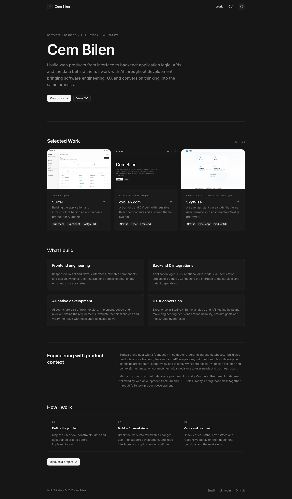
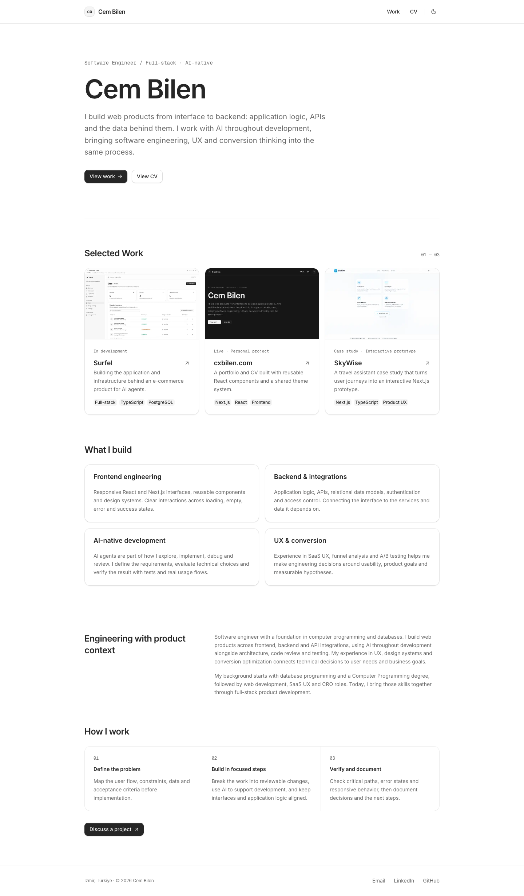

<div align="center">

# cxbilen.com

**Portfolio & CV of Cem Bilen — Software Engineer · Full-stack · AI-native**

[](https://nextjs.org/)
[](https://react.dev/)
[](https://www.typescriptlang.org/)
[](https://tailwindcss.com/)
[](https://cxbilen.com)
[](LICENSE)

[**Live site → cxbilen.com**](https://cxbilen.com)

</div>

---

## ✨ Features

- ⚡ **Portfolio-first** — hero, selected work grid, and per-project case studies
- 🌓 **Auto dark / light** — follows system preference with a manual toggle
- 📄 **Native CV** — single-column CV with PDF, DOCX and text downloads
- 🎨 **One design system** — official COSS default tokens, Inter and Geist Mono across site and CV
- 📱 **Responsive** — single-column CV that reflows on mobile
- 🔎 **SEO-ready** — metadata, Open Graph, sitemap, and robots out of the box

## 🖼️ Screenshots

| Dark | Light |
| --- | --- |
|  |  |

## 🚀 Getting started

```bash
git clone https://github.com/CXBilen/cxbilen.com.git
cd cxbilen.com
npm install
npm run dev
```

Open [http://localhost:3000](http://localhost:3000).

## 🧰 Tech stack

- [Next.js 15](https://nextjs.org/) (App Router) + [React 19](https://react.dev/)
- [TypeScript](https://www.typescriptlang.org/)
- [Tailwind CSS v4](https://tailwindcss.com/)
- [COSS UI](https://coss.com/ui/docs) + [Base UI](https://base-ui.com/)
- [next-themes](https://github.com/pacocoursey/next-themes)
- [Vitest](https://vitest.dev/) + [Testing Library](https://testing-library.com/)

## 🗂️ Project structure

```
app/            # routes: home, /work, /work/[slug], /cv
components/     # Nav, Hero, ProjectCard, ThemeToggle, cv/*, work/*
lib/            # projects + cv data
styles/         # theme tokens
public/         # images, PDFs, favicons
```

## 🧪 Scripts

| Command | Description |
| --- | --- |
| `npm run dev` | Start the dev server |
| `npm run build` | Production build |
| `npm run test` | Run the test suite |

### Update the CV

Edit `lib/cv.ts` to update the shared CV content. With Node.js 22.18+ and Playwright Chromium installed, regenerate the standalone HTML, canonical ATS PDF, legacy PDF themes and text export:

```bash
CV_DATA_JSON=/tmp/cxbilen-cv-data.json node scripts/export-cv.mjs
python3 scripts/export-cv-docx.py /tmp/cxbilen-cv-data.json
```

The DOCX exporter requires `python-docx`. To use an existing Chrome installation, set `CV_CHROMIUM_PATH` to its executable. Font files are bundled under `Cem Bilen CV 2026 HTML/fonts/` with their license. The canonical PDF uses the light palette regardless of the website theme.

All exports preserve one-column reading order, standard headings and selectable text. No external ATS service receives the CV. Parser compatibility should be checked using text extraction and the destination platform's preview; no format can guarantee parsing by every ATS.

Run `python3 scripts/verify-cv.py` after exporting; see [CV verification](docs/cv-verification.md) for dependencies, checks and recorded results.

See [Design system](docs/design-system.md) for the pinned COSS sources and [Third-party notices](THIRD_PARTY_NOTICES.md) for attribution.

## ▲ Deploy

[](https://vercel.com/new/clone?repository-url=https://github.com/CXBilen/cxbilen.com)

## 📄 License

[MIT](LICENSE) © Cem Bilen
